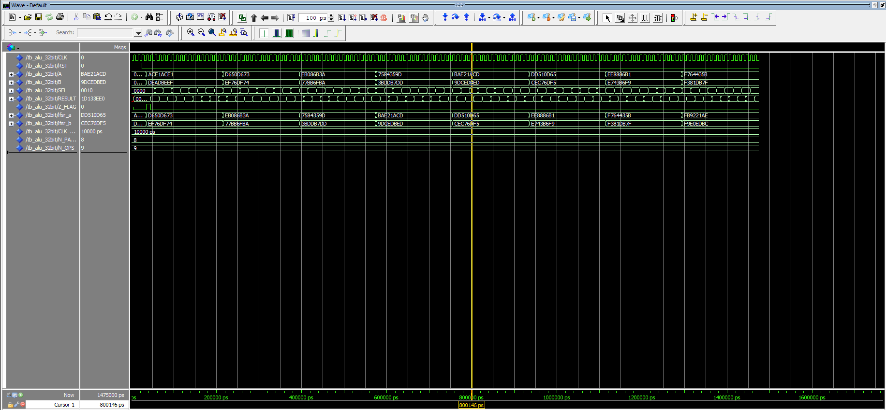
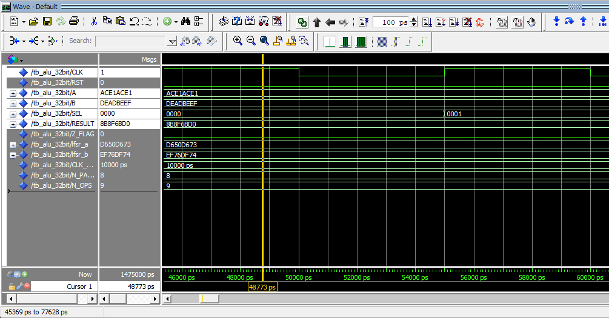
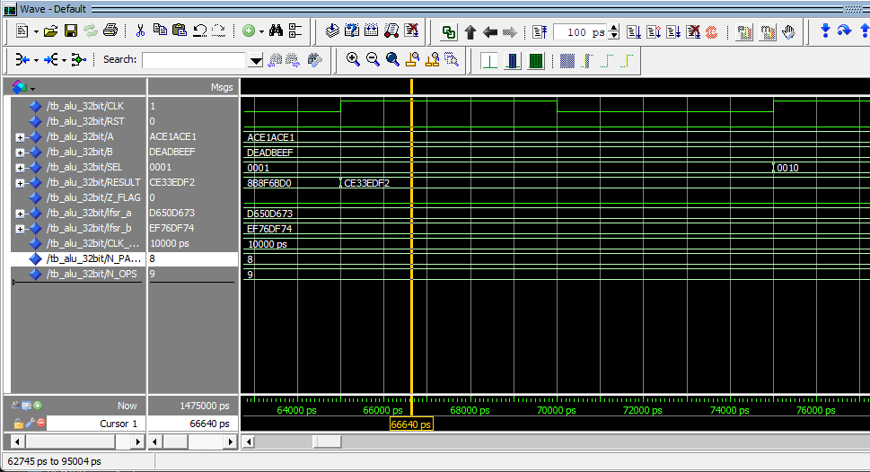
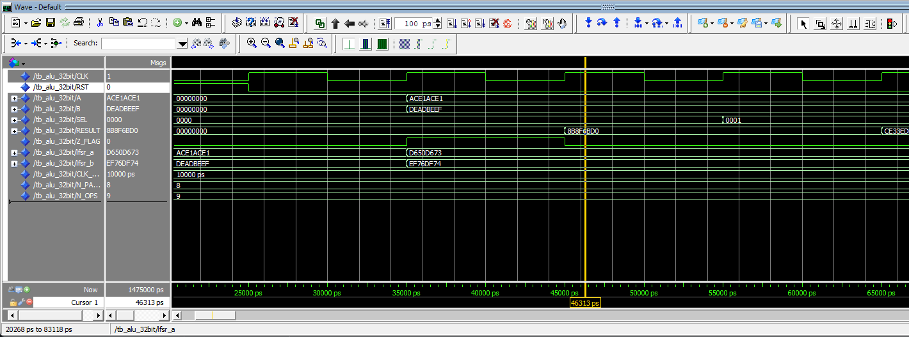
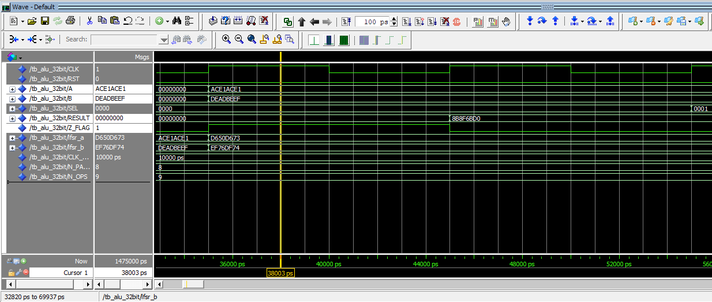

<div align="center">

# 🔧 32-bit Registered ALU — VHDL


**Arithmetic Logic Unit — 32-bit clocked, 9 operations, parametric testbench**

</div>

---

## 📋 Table of Contents

- [Overview](#-overview)
- [Project Structure](#-project-structure)
- [Architecture](#-architecture)
- [Operations](#-operations--sel-encoding)
- [Ports](#-port-description)
- [Waveforms](#-simulation-waveforms)
- [Testbench](#-testbench-details)
- [How to Run](#-how-to-run)
- [Future Improvements](#-future-improvements--extension-guide)
- [Notes for Contributors](#-notes-for-contributors)

---

## 🧠 Overview

This project implements a fully **registered (clocked) 32-bit ALU** in VHDL.  
The output is captured on the **rising edge of CLK**, making it suitable for integration inside any synchronous digital system or CPU datapath.

**Key features:**
- 9 operations: Arithmetic, Logical, and Shift
- Synchronous active-high reset (`RST`)
- Zero flag (`Z_FLAG`) registered alongside the result
- Clean two-stage architecture: combinational logic → register stage
- VHDL-93 compatible (runs on ModelSim default settings)
- Parametric self-sweeping testbench with LFSR-generated inputs

---

## 📁 Project Structure

```
ALU/
│
├── alu_32bit.vhd        # DUT  — 32-bit Registered ALU
├── tb_alu_32bit.vhd     # TB   — Parametric clock-driven testbench
├── wave_alu.do          # ModelSim DO script (compile + wave auto-open)
└── README.md            # This file
```

---

## 🏗️ Architecture

The design is split into two clean stages:

```
         ┌──────────────────────────────────────┐
 A[31:0] │                                      │
 B[31:0] │   comb_proc                          │
 SEL[3:0]│   (Combinational)   comb_result ─────┤──► reg_proc ──► RESULT[31:0]
         │                                      │   (Clocked)  ──► Z_FLAG
         │                                      │    ↑
         └──────────────────────────────────────┘   CLK / RST
```

- **`comb_proc`** — Pure combinational logic. Decodes `SEL` and computes `comb_result` instantly.
- **`reg_proc`** — Registers `comb_result` into `RESULT` and `Z_FLAG` on every rising edge of `CLK`.  
  On `RST = '1'` outputs are cleared to zero synchronously.

---

## ⚙️ Operations — SEL Encoding

| SEL (bin) | SEL (hex) | Operation | Expression | Notes |
|:---------:|:---------:|-----------|------------|-------|
| `0000` | `0` | **ADD** | `A + B` | Signed, wraps on overflow |
| `0001` | `1` | **SUB** | `A - B` | Two's complement result |
| `0010` | `2` | **MUL** | `A × B` | Lower 32-bit of 64-bit product |
| `0011` | `3` | **AND** | `A and B` | Bitwise |
| `0100` | `4` | **OR** | `A or B` | Bitwise |
| `0101` | `5` | **XOR** | `A xor B` | Bitwise |
| `0110` | `6` | **NOT** | `not A` | B is ignored |
| `0111` | `7` | **SHL** | `A << B[4:0]` | Logical shift left, 0–31 bits |
| `1000` | `8` | **SHR** | `A >> B[4:0]` | Logical shift right, 0–31 bits |

> **Shift amount:** only the lower 5 bits of `B` are used (`B[4:0]`), giving a range of 0–31.  
> **MUL:** full 64-bit product is computed internally; only the lower 32 bits are registered as output.

---

## 🔌 Port Description

### `alu_32bit.vhd`

| Port | Direction | Width | Description |
|------|:---------:|:-----:|-------------|
| `CLK` | in | 1 | Clock — rising edge triggered |
| `RST` | in | 1 | Synchronous reset, active-high |
| `A` | in | 32 | Operand A |
| `B` | in | 32 | Operand B (also shift amount via `B[4:0]`) |
| `SEL` | in | 4 | Operation select (see table above) |
| `RESULT` | out | 32 | Registered ALU output |
| `Z_FLAG` | out | 1 | Zero flag — `'1'` when `RESULT = 0x00000000` |

---

## 📸 Simulation Waveforms

### Full Sweep — All 9 Operations
> *Add your ModelSim screenshot here*

<!-- 📷 REPLACE: screenshot of full wave showing CLK, RST, A, B, SEL, RESULT, Z_FLAG across all 9 operations -->


---

### ADD — `0xACE1ACE1 + 0xDEADBEEF = 0x8B8F6BD0`
> *Add your ADD operation close-up here*

<!-- 📷 REPLACE: zoom in on the ADD cycle showing A=ACE1ACE1, B=DEADBEEF, RESULT=8B8F6BD0 -->


---

### SUB — `0xACE1ACE1 - 0xDEADBEEF = 0xCE33EDF2`
> *Add your SUB operation close-up here*

<!-- 📷 REPLACE: zoom in on SUB cycle, note two's complement negative result -->


---

### Reset Behavior
> *Add your RST waveform here*

<!-- 📷 REPLACE: show RST=1 forcing RESULT=0 and Z_FLAG=1, then RST=0 resuming normal operation -->


---

### Zero Flag Trigger
> *Add your Z_FLAG=1 moment here*

<!-- 📷 REPLACE: show any operation that produces RESULT=0x00000000 with Z_FLAG going high -->


---

## 🧪 Testbench Details

### `tb_alu_32bit.vhd`

| Parameter | Value | Description |
|-----------|:-----:|-------------|
| `CLK_PERIOD` | 10 ns | Clock period (100 MHz) |
| `N_PAIRS` | 8 | Number of (A,B) input pairs to generate |
| `N_OPS` | 9 | Fixed — one pass per SEL code |
| Total cycles | ~160 | `(N_PAIRS × N_OPS × 2) + reset` |

**How it works:**

```
RST = 1  →  3 cycles  →  RST = 0
│
└─ for each pair (0 → N_PAIRS-1):
       LFSR generates A and B
       │
       └─ for each SEL (0 → 8):
              cycle 1: apply A, B, SEL
              cycle 2: read registered RESULT + Z_FLAG
              print report line
```

**LFSR Polynomial:**  
32-bit Galois LFSR — tap mask `0x80200003`  
Seeds: `A_seed = 0xACE1ACE1`, `B_seed = 0xDEADBEEF`

**To change input values:** edit `N_PAIRS` and the LFSR seeds in `tb_alu_32bit.vhd`:
```vhdl
constant N_PAIRS    : integer := 8;          -- ← change pair count here
signal lfsr_a : ... := x"ACE1ACE1";         -- ← change A seed here
signal lfsr_b : ... := x"DEADBEEF";         -- ← change B seed here
```

---

## ▶️ How to Run

### ModelSim — One Command

```tcl
do wave_alu.do
```

This script will:
1. Create `work` library
2. Compile `alu_32bit.vhd` then `tb_alu_32bit.vhd`
3. Load simulation
4. Add all signals to Wave window with colors
5. Run until completion
6. Zoom wave to fit

---

### ModelSim — Manual

```tcl
vlib work
vcom -93 alu_32bit.vhd
vcom -93 tb_alu_32bit.vhd
vsim work.tb_alu_32bit
add wave /*
run -all
wave zoom full
```

---

### GHDL (Linux / CI)

```bash
ghdl -a --std=08 alu_32bit.vhd
ghdl -a --std=08 tb_alu_32bit.vhd
ghdl -e --std=08 tb_alu_32bit
ghdl -r --std=08 tb_alu_32bit
```

---

## 🚀 Future Improvements & Extension Guide

> This section is a roadmap for anyone who wants to extend the design.  
> Each item shows **what to add** and **exactly where in the code**.

---

### 1. 🏴 Add Carry & Overflow Flags

**Where:** `alu_32bit.vhd` — entity ports + `reg_proc`

```vhdl
-- In entity, add:
C_FLAG : out std_logic;   -- Carry flag
V_FLAG : out std_logic;   -- Overflow flag

-- In architecture, add a 33-bit signal:
signal add_result_33 : std_logic_vector(32 downto 0);

-- In comb_proc, for ADD/SUB:
add_result_33 <= std_logic_vector(
    ('0' & unsigned(A)) + ('0' & unsigned(B)));

-- In reg_proc, register the extra bits:
C_FLAG <= add_result_33(32);
V_FLAG <= (A(31) xor comb_result(31)) and
          (not (A(31) xor B(31)));  -- signed overflow
```

---

### 2. ➡️ Add Arithmetic Shift Right (ASR)

**Where:** `alu_32bit.vhd` — add new SEL constant + case entry in `comb_proc`

```vhdl
-- Add constant (use SEL = "1001"):
constant OP_ASR : std_logic_vector(3 downto 0) := "1001";

-- In comb_proc case statement:
when OP_ASR =>
    comb_result <= std_logic_vector(
        shift_right(signed(A), shift_amt));
-- Note: shift_right on signed = arithmetic (sign-extending)
```

Also update `N_OPS` in `tb_alu_32bit.vhd`:
```vhdl
constant N_OPS : integer := 10;  -- was 9
```

---

### 3. 🔁 Add Rotate Operations (ROL / ROR)

**Where:** `alu_32bit.vhd` — `comb_proc` case, add SEL `"1010"` and `"1011"`

```vhdl
constant OP_ROL : std_logic_vector(3 downto 0) := "1010";
constant OP_ROR : std_logic_vector(3 downto 0) := "1011";

when OP_ROL =>
    comb_result <= std_logic_vector(
        rotate_left (unsigned(A), shift_amt));
when OP_ROR =>
    comb_result <= std_logic_vector(
        rotate_right(unsigned(A), shift_amt));
```

---

### 4. 📊 Widen to 64-bit

**Where:** `alu_32bit.vhd` — change **every** `31 downto 0` → `63 downto 0`  
and update MUL to output 64 of 128 bits.

```vhdl
-- Entity ports become:
A      : in  std_logic_vector(63 downto 0);
B      : in  std_logic_vector(63 downto 0);
RESULT : out std_logic_vector(63 downto 0);

-- Shift amount uses B[5:0] instead of B[4:0]:
shift_amt <= to_integer(unsigned(B(5 downto 0)));
```

Also update `tb_alu_32bit.vhd`:
- Change all `std_logic_vector(31 downto 0)` → `(63 downto 0)`
- Update `to_hex_str` function: change `(1 to 8)` → `(1 to 16)` and loop `7 downto 0` → `15 downto 0`

---

### 5. 🔢 Add Negative Flag (N)

**Where:** `alu_32bit.vhd` — `reg_proc`, one line after RESULT assignment

```vhdl
-- In entity:
N_FLAG : out std_logic;   -- Negative flag (MSB of result)

-- In reg_proc:
N_FLAG <= comb_result(31);   -- '1' if result is negative (signed)
```

---

### 6. ✅ Add Self-Checking to Testbench

**Where:** `tb_alu_32bit.vhd` — inside `stim_proc`, after each `wait until rising_edge`

```vhdl
-- Add expected value computation and compare:
variable expected : std_logic_vector(31 downto 0);
-- compute expected based on s (SEL) and A, B values
-- then:
assert RESULT = expected
    report "MISMATCH on " & op_str(s)
    severity error;
```

---

## 📝 Notes for Contributors

| Topic | Note |
|-------|------|
| **VHDL Standard** | Code is written VHDL-93 safe. Avoid `to_hstring`, `?=`, `and` on `std_logic_vector` in process without `ieee.numeric_std` |
| **`when...else` inside process** | ❌ Not allowed in sequential context — use `if/else` instead |
| **Shift amount** | Always mask to `B[4:0]` (5 bits) for 32-bit. Update to `B[5:0]` if widening to 64-bit |
| **MUL width** | Full product is `64-bit signed`. Only lower 32 stored. If you need upper 32, add a `RESULT_HI` port |
| **Adding a new SEL code** | 1) Add `constant OP_XXX` in DUT 2) Add `when OP_XXX` in `comb_proc` 3) Increment `N_OPS` in TB 4) Add label in `op_str()` function in TB |
| **Changing clock frequency** | Edit `CLK_PERIOD` in TB only — DUT is fully synchronous and technology-independent |
| **Reset** | Reset is **synchronous** active-high. To change to async: move `if RST` outside `if rising_edge` in `reg_proc` |

---

<div align="center">

Made with VHDL — tested on ModelSim & GHDL

</div>
